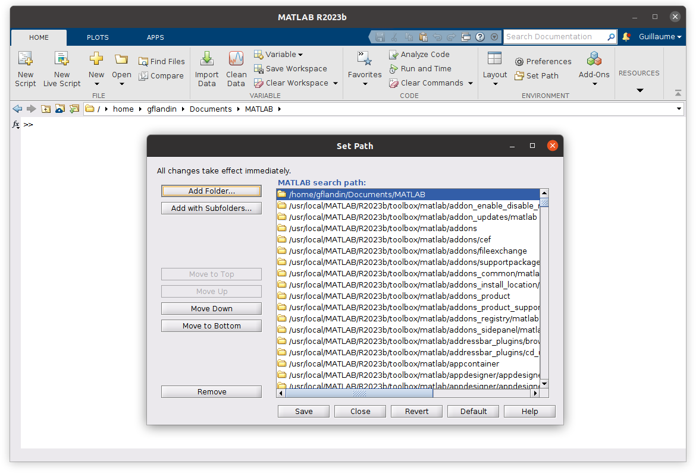

# SPM Installation with MATLAB

!!! info "Prerequisites"
    The SPM software is a collection of [MATLAB](https://www.mathworks.com/products/matlab.html) functions and thus requires the MATLAB software to be installed on your computer in order to run. SPM requires only core MATLAB to run (no special toolboxes are required - unless stated otherwise).

    Each SPM version was written for a particular MATLAB version and will not work with earlier versions. MATLAB versions released after SPM can have some peculiarities but SPM developers try to provide compatibility fixes in the updates.

## Installation

=== "Windows"

    1. Download `spm12.zip` from the [SPM website](https://www.fil.ion.ucl.ac.uk/spm/software/download/).

    2. Unzip `spm12.zip` in a folder of your choice, such as `C:\Users\login\Documents\MATLAB\spm12`.

    3. Start MATLAB and add SPM to your path, either using:

        `Home` :material-arrow-right-bold: `Set Path` :material-arrow-right-bold: `Add Folder...`: select the directory containing your SPM installation then click on `Save` and `Close`.

        or type the following at the MATLAB prompt:

        ```matlab
        addpath('C:\Users\<login>\Documents\MATLAB\spm12')
        savepath % if you want to save the current MATLAB path
        ```

        If you are using MATLAB without its desktop, you can open the Set Path dialog box by typing `pathtool` at the MATLAB prompt.

=== "macOS"

    1. Download  `spm12.zip` from the [SPM website](https://www.fil.ion.ucl.ac.uk/spm/software/download/) in your home directory.

    2. Uncompress the archive by typing the following in a Terminal:
        ```bash
        cd /Users/<login>
        unzip spm12.zip
        ```

    3. Start MATLAB and add SPM to your path, either using:
        `File` :material-arrow-right-bold: `Set Path` :material-arrow-right-bold: `Add Folder...`

        or typing the following at the MATLAB prompt:

        ```matlab
        addpath /Users/<login>/spm12
        savepath % if you want to save the current MATLAB path
        ```

    !!! failure "Troubleshooting"
        If, after installation, you have validation issues with the **MEX files on macOS** such as:
        ```
        "`*.mexmaci64` cannot be opened because the developer cannot be verified. 
        macOS cannot verify that this app is free from malware"
        ```
        or:
        ```
        "Code signature not valid for use in process using Library Validation: 
        library load disallowed by system policy"
        ```
        please follow the instructions detailed [here](../development/compilation/macos/#troubleshooting); you do not need to recompile the MEX files but they have to be approved beforehand.

    !!! failure "Troubleshooting"
        If, after installation, you get an error indicating that the **MEX files for MACA64 are missing**:
        ```
        >> spm
        Error using spm_check_installation>check_basic
        SPM uses a number of MEX files, which are compiled functions.
        These need to be compiled for the various platforms on which SPM
        is run. It seems that the compiled files for your computer platform
        are missing or not compatible. See
            https://en.wikibooks.org/wiki/SPM/Installation_on_64bit_Mac_OS_(Intel)
        for information about how to compile MEX files for MACA64
        in MATLAB 23.2.0.2365128 (R2023b).
        ```
        this is because you are running [native Apple silicon MATLAB (R2023b onwards)](https://uk.mathworks.com/support/requirements/apple-silicon.html) and the MEX files are not available for that platform in SPM12. Instead download and install the [development version of SPM](https://github.com/spm/spm) or the [maintenance branch of SPM12](https://github.com/spm/spm12/tree/maint) where the `*.mexmaca64` MEX files have been compiled.

=== "Linux"

    1. Download `spm12.zip` from the [SPM website](https://www.fil.ion.ucl.ac.uk/spm/software/download/) in your home directory.

    2. Uncompress the archive by typing the following in a terminal:

        ```bash
        cd /home/<login>
        unzip spm12.zip
        ```

    3. Start MATLAB and add SPM into your path, either using:

        `File` :material-arrow-right-bold: `Set Path` :material-arrow-right-bold: `Add Folder...`

        or typing the following at the MATLAB prompt:

        ```matlab
        addpath /home/<login>/spm12
        savepath % if you want to save the current MATLAB path
        ```

    !!! failure "`Crash at startup`"

    The following concerns a situation where MATLAB generates a segmentation fault when opening the SPM interface with errors like:
    ```
    BadWindow (invalid Window parameter)
    ``` 
    ```
    serial 20133 error_code 3 request_code 20 minor_code 0
    ```
    ```
    Pango-CRITICAL **: pango_font_description_from_string: assertion 'str != NULL' failed
    ```
    ```
    GLib-CRITICAL **: g_once_init_leave: assertion 'result != 0' failed
    ``` 
    ```
    GLib-GObject-CRITICAL **: g_type_register_dynamic: assertion 'parent_type > 0' failed
    ```

    This is likely to be an issue with the display of the welcoming message in the Graphics window as a web document.

    One fix is to [comment one line in spm.m.](https://github.com/spm/spm12/blob/r7771/spm.m#L352). Another fix not requiring to modify the SPM source code is to [define an environment variable.](https://github.com/spm/spm12/blob/r7771/spm_browser.m#L54):
    ```
    setenv('SPM_HTML_BROWSER','0')
    ```


!!! danger
    If using the graphical interface, make sure to use the `Add Folder...` button and not `Add with Subfolders...`. SPM will automatically add the appropriate subfolders to the MATLAB path at runtime.



You can then launch SPM by typing `spm` at the MATLAB prompt.

## Update

If you have just downloaded the `spm12.zip` archive, it already contains the latest set of updates. To update SPM when a new version is released:

1. [Download `spm12_updates_rxxxx.zip`](https://www.fil.ion.ucl.ac.uk/spm/download/spm12_updates/).
2. Uncompress `spm12_updates_rxxxx.zip` on top of the folder containing your SPM installation so that newer files overwrite existing files.

Alternatively, you can use the `spm_update.m` function:

```matlab
spm_update
```

If a new version is available, it can be applied to your local installation by typing:

```matlab
spm_update update
```
