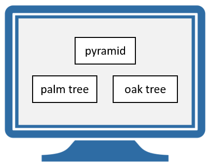
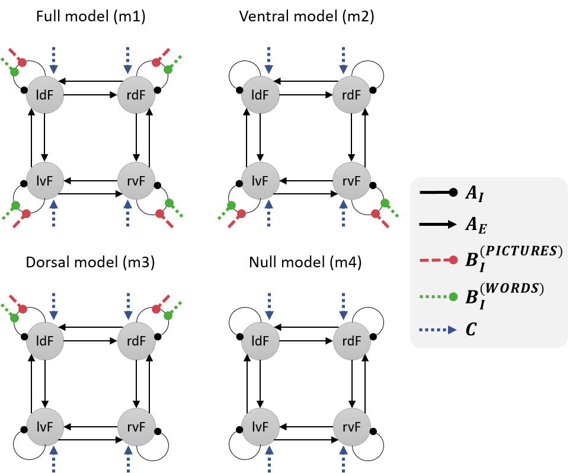
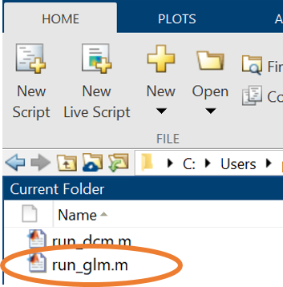
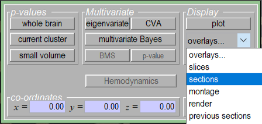
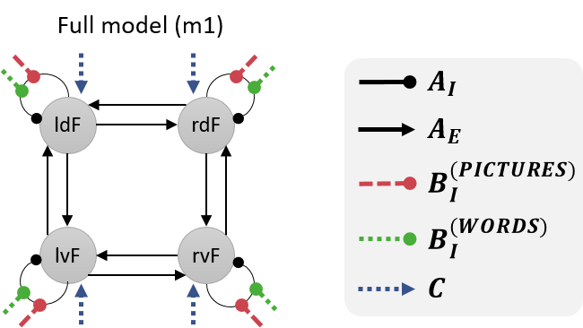
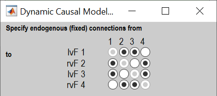
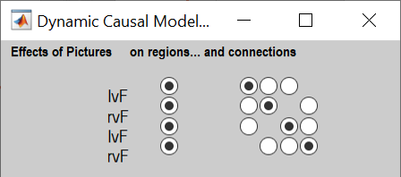

# DCM for fMRI - 1st level

Dynamic Causal Modelling (DCM) involves specifying a model for each participant (first-level analysis) and then specifying a model of between-subjects effects (second-level analysis). This tutorial works through first level analysis using data from a previously published study by [Seghier et al. (2011)](https://doi.org/10.1093/cercor/bhq203).

## Background
### Experimental design
This was an fMRI experiment with a 2 x 2 factorial design. The factors were task (semantic matching or perceptual matching) and stimulus type (pictures or words).

Semantic blocks consisted of four trials. Within each trial, an array of stimuli was shown on the screen – one stimulus was on top, two were underneath. Participants had to indicate which of the bottom stimuli matched the stimulus on top, in terms of its meaning. Blocks either used pictures or words as stimuli.
 
<figure id="Fig:pyramidspalmtrees" markdown>

<figcaption>Example trial from a semantic Words block. The correct response is “palm tree”, because it matches pyramid semantically. Screen image created by Guilherme Furtado from Noun Project.</figcaption>
</figure>

Perceptual blocks were similar, except participants had to indicate which of the bottom stimuli was more visually similar to the top stimulus. Blocks either used pictures or word-like symbols.

The original aim of the experiment was to investigate why people differ in their laterality for semantic processing of words – i.e., why some people’s neural responses are more lateralized to the left hemisphere and others to the right.

### Previous SPM results
A group-level SPM analysis by Seghier et al. showed that four regions of interest (ROIs) had a significant main effect of [semantic matching > perceptual matching]. For the example participant that we will model, their nearest coordinates to the group average are shown in the table below.

| ROI	|	Name	|	Description					|	Peak MNI coordinates	|
| ----- | --------- | ----------------------------- | ------------------------- |
|	1	|	lvF		|	Left ventral frontal		|	-34, 34, -10			|
|	2	|	ldF		|	Left dorsal frontal			|	-50, 16, 34				|
|	3	|	rvF		|	Right ventral frontal		|	26, 34, -14				|
|	4	|	rdF		|	Right dorsoal frontal		|	54, 22, 32				|

### Hypotheses
We will investigate the effective connectivity among these four brain regions. Specifically, we will compare the evidence for four hypotheses:

1.	When making semantic decisions, all four of the regions discriminated between pictures and words.
2.	Only the ventral regions (lvF and rvF) discriminated between pictures and words. Any differences in the dorsal regions’ response were due to afferent connections from ventral regions.
3.	Only dorsal regions (ldF and rdF) discriminated between pictures and words. Any differences in the ventral regions’ response were due to afferent connections from dorsal regions.
4.	None of the regions discriminated pictures and words (null model).

We will specify a DCM for each hypothesis. These models will differ only terms of which connections are modulated by pictures and words, as illustrated below.

<figure id="Fig:pyramidspalmtrees" markdown>
{width=100%}
<figcaption>Four DCMs that we will compare. They differ in where the modulatory effects of making semantic judgements (pictures and words) had effects.</figcaption>
</figure>

 
## Analysis procedure
### Preparing the dataset
1.	[Download the dataset by clicking here](http://www.fil.ion.ucl.ac.uk/~pzeidman/first_level.zip). Unzip it to a location of your choosing on your computer. 
2.	Open MATLAB and use the left-hand panel to change to the scripts directory. Double click run_glm.m in the left-hand panel.

	<figure id="Fig:pyramidspalmtrees" markdown>
	
	<figcaption>Double click the run_glm.m script</figcaption>
	</figure>

3.	Run the run_glm.m script by pressing the green “Run” button at the top. This will specify a General Linear Model (GLM), fit it to each voxel producing statistical maps, and generate contrast images.

### Viewing the SPM results
Before we can perform the DCM analysis, we will need to extract a representative timeseries from each region. We will identify voxels that show an effect of semantic > perceptual trials, as close as possible to the group average coordinates in the table above.

1.	Open SPM by typing: **spm fmri** and press enter.
2.	View the results of the General Linear Model (GLM) analysis. To do this, click **Results** in the main SPM window. Then navigate up one directory by clicking “..” on the left-hand side, then click “GLM”, then click “sub-01”, then click “SPM.mat” on the right-hand side, and press Done.
3.	Select the **Semantic – Perceptual** contrast and press **Done**.
4.	For “apply masking”, select **none**.
5.	For “p value adjustment to control” select **none**.
6.	Accept the default value for “threshold” and “& extent threshold” by pressing **enter** twice. 
7.	For clarity, view the results on a template anatomical image. Click **overlays** and then **sections** in the Results window, as shown below.

	<figure id="Fig:sectionsmenu" markdown>
	
	<figcaption>Click overlays then sections to view the results on an anatomical image.</figcaption>
	</figure>

8.	Navigate to where SPM is stored on your computer. Click **canonical** on the left-hand side, then click **avg152T1.nii** on the right-hand side. Then click **Done**.

You should now see regions in this participant’s brain that had a more positive BOLD response during semantic blocks compared to perceptual blocks. We will extract timeseries from four of these regions for DCM analysis.

### Timeseries extraction
We will start by extracting a representative fMRI timeseries for region ldF. To do this, we will take all the voxels within an 8mm sphere centred on this participant’s peak activation. Then, SPM will  compute a principal component analysis, and retain the first principal component (eigenvariate). This single timeseries can provide a better summary of the included voxels than simply taking the mean. 

1.	At the bottom of the Results window you will see text boxes for entering coordinates. Enter **[-50 16 34]** as illustrated below, then press enter. 

	<figure id="Fig:coordsbox" markdown>
	
	<figcaption>Enter the coordinates for region ldF then press enter.</figcaption>
	</figure>

2.	Click the **eigenvariate** button
3.	For “name of region”, type **ldF**, and press **enter**
4.	For “adjust data”, select **Effects of interest**
5.	For “VOI definition”, press **sphere**.
6.	For “sphere radius”, type **8** and press enter
7.  The resulting timeseries has been stored in a file called VOI_ldF_1.mat . Now repeat these steps for region **rdF**, which has coordinates **[54, 22, 32]**. 

To save time, the ROIs for the ventral regions (lvF and rvF) have been prepared for you and are provided in the GLM directory.

### DCM Specification - full model

We’ll start by specifying model 1, which to re-cap, has the following structure:

<figure id="Fig:fullmodel" markdown>

<figcaption>Structure of model 1, which we're going to create. It's the "full" model, in the sense that it has all the parameters of interest switched on. </figcaption>
</figure>

1.	In MATLAB, navigate to the GLM\sub-01 directory using the left-hand pane.
2.	Re-start SPM by typing into MATLAB: **spm fmri** and pressing enter. Press the large **Dynamic Causal Modelling** button in the main SPM window.
3.	Click **specify**
4.	Select the **SPM.mat** file on the right-hand side, then press **Done**. This provides DCM with the timing of the experiment.
5.	Type **m1** and press **enter**.
6.	Select the timeseries (Volumes of Interest, VOIs). Importantly, for consistency with these instructions select them in the order: **lvF, ldF, rvF, rdF**. Then press **Done**.
7.	For “include Pictures”, press **yes**.
8.	For “include Words”, press **yes**.
9.	For “include Control_Pictures”, press **no**.
10.	For “include Control_Nonwords”, press **no**.
11.	For “include Instruction”, press **no**.
12.	Select the following options:

    a.	Leave VOI timings on the default (just **press enter**)  
    b.	Leave echo time on the default (just **press enter**)  
	c.	Modulatory effects: **bilinear**  
	d.	States per region: **one**  
	e.	Stochastic: **no**  
	f.	Centre input: **yes**  
	g.	Fit timeseries or CSD: **timeseries**
	
13.	Choose which connections to switch on (A-matrix parameters, also called endogenous or fixed connections). These should match the black arrows in the network diagrams above, which corresponds to the picture shown below:
 
	<figure id="Fig:Amatrix" markdown>
	
	<figcaption>Click the buttons to switch on connections among regions (A-matrix parameters). Columns are outgoing connections, rows are incoming connections.</figcaption>
	</figure>
	
14.	“Effects of Pictures” refers to the semantic trials that used picture stimuli. Choose whether pictures should drive each region (left hand buttons) and/or modulate particular connections (right hand buttons). We will have pictures drive all regions and modulate all self-connections:

	<figure id="Fig:Bmatrix" markdown>
	
	<figcaption>Click the buttons on the left to have Pictures drive each region, and the buttons on the right to set Pictures to modulate the self-connection on each region.
	</figure>
 
15.	“Words” are the semantic trials that used word stimuli. For Words, select the same options as in the previous step.
16.	For “Merge & binarize driving inputs”, select **yes**. This will combine Pictures and Words into a single driving input to the regions we selected (all four). Pictures and words will remain separate for modulating the self-connections.

### DCM Specification - other models
To make the other models, we could click through the buttons again, changing which connections are modulated by Pictures and Words. However, we can save time by using scripting instead. We’ll load the first model we made using the GUI, then for each new model we will change the B-matrix (modulatory inputs), then save it with a new name.
Copy and paste the following code into MATLAB:

```MATLAB
% Tip: In the connectivity matrices below, row i column j is the connection  
% from region j to i. The regions are ordered: lvF, ldF, rvF, rdF.
 
% Load the first DCM we made
load('DCM_m1.mat');
 
% Create model m2 (ventral model)
% -------------------------------------------------------------------------
% Change the modulatory inputs
DCM.b(:,:,1) = [1 0 0 0
                0 0 0 0
                0 0 1 0
                0 0 0 0]; % Pictures
            
DCM.b(:,:,2) = [1 0 0 0
                0 0 0 0
                0 0 1 0
                0 0 0 0]; % Words            
 
save('DCM_m2.mat','DCM');
 
% Create model m3 (dorsal model)
% -------------------------------------------------------------------------
% Change the modulatory inputs
DCM.b(:,:,1) = [0 0 0 0
                0 1 0 0
                0 0 0 0
                0 0 0 1]; % Pictures
            
DCM.b(:,:,2) = [0 0 0 0
                0 1 0 0
                0 0 0 0
                0 0 0 1]; % Words            
 
save('DCM_m3.mat','DCM');
 
% Create model m4 (null model)
% -------------------------------------------------------------------------
% Change the modulatory inputs
DCM.b(:,:,1) = zeros(4,4);
DCM.b(:,:,2) = zeros(4,4);
 
save('DCM_m4.mat','DCM');
```

### Model estimation and Bayesian model comparison
Finally, we will estimate all four models to obtain the posterior probability for each. We will use the Batch to estimate the three models at once.

1.	Re-open SPM by typing **spm fmri** and pressing enter.
2.	Press **Batch**, then from the menu at the top, press **SPM** -> **DCM** -> **DCM estimation**.
3.	Click **Select DCMs**, then in the box underneath click **Per subject**.
4.	Click **Per subject** in the top box, then click **New: Subject**
5.	Double click **Select DCM_\*.mat** and, in order, click **DCM_m1.mat, DCM_m2.mat, DCM_m3.mat, DCM_m4.mat**. Then press **Done**.
6.	Double click on **Directory**, then choose the current directory by clicking the dot (**.**) On the right hand side of the file selector, then press **Done**.
7.	Double click on **Name**, type **example** and press OK.
8.	Press the **green play button** at the top.

After a few seconds or minutes, the result of the Bayesian model comparison will be shown:

<figure id="Fig:BMC" markdown>

<figcaption>Results of the Bayesian model comparison.</figcaption>
</figure>
 
The left-hand plot shows the log evidence (free energy) for each model relative to the best model, which is set to zero. This shows that the best model was m1 (zero), the second best was m3, the third best was m2, and the worst was m2. (NB a difference in log-evidence larger than 3 is considered “strong evidence” for a difference.)

The result in the right-hand plot is easier to read. This is the posterior probability for each model, and the numbers sum to one. The best model was m1, the second best was m3 (22% probability), and there was no evidence for m2 or m4.

We could then report this result in a paper as follows:

>We asked which regions within a frontal network discriminate between pictures and words. The best explanation, with 78% probability, was that all four regions perform this discrimination (model m1). The second-best explanation, with 22% probability, was that only dorsal regions discriminate (m3). This was a far better explanation than only ventral regions, which had probability approaching zero. The inclusion of a null model (m4), with no discrimination between pictures and words, confirmed that there was strong evidence that pictures and words were treated differently by the network (a difference in log-evidence of 7.88 between the null model and the next best model).

## Next steps
Having identified the best model (m1), the next step would be to report its parameters (i.e., connection strengths). These can be reviewed as follows:

1.	Return to the SPM main window. If you cannot find it, type: **spm fmri** and **press enter**.
2.	Press **Dynamic Causal Modelling**, then **Review**.
3.	Select **DCM_m1.mat** then press **done**.
4.	Use the dropdown menu in the grey window to view different aspects of the model.
