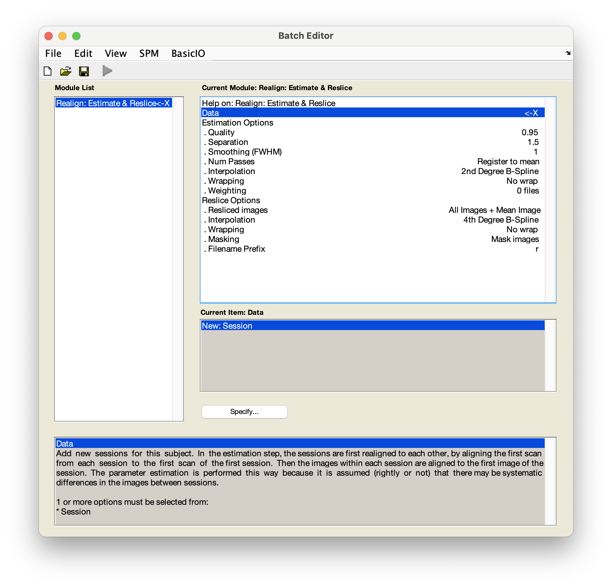

# fMRI data preprocessing

## Realignment

Realignment refers to correcting the functional data for movement that has occurred during scanning. 

??? info "Why is correcting for motion important?" 
    Motion is one of the biggest confounds in fMRI. Movement in the scanner is problematic because it can change the mapping between specific voxels and brain regions, meaning that over the course of a scan signal from one specific location in the brain may be acquired across several different voxels. Movement is also known to induce large signal changes in the data which can introduce structured spatio-temporal noise into the data and cause spurious results.

    For a thorough overview of issues related to motion in fMRI, see the SPM book:

    [Penny, W., Friston, K., Ashburner, J., Kiebel, S., & Nichols, T. (2006). *Statistical parametric mapping: The analysis of functional brain images*.](https://www.fil.ion.ucl.ac.uk/spm/doc/#books)

1. From the SPM main window, select `Realign (Estimate & Reslice)`. You will see a pop-up window called the Batch Editor appear, looking like this:

    

2. Select `Data` :material-arrow-right-bold: `New: Session`. 
3. In the pop-up window, use the left-hand panel to navigate to `sub-01/func/`. 
4. Use the filter box to load the full time series - delete `1` and instead type `NaN` underneath the `Filter` button and press ++return++.
5. In the right-hand panel, select `sub-01_task-auditory_bold.nii` - this is a 4D file containing the fMRI time series - and press `Done`.
6. Back in the batch window, navigate to `Resliced images` under `Reslice options` and select `All images + mean image`. 
7. Save this batch for future reference - `File` :material-arrow-right-bold: `Save batch`. Give the file a meaningful name, such as `realignment_batch.mat`. 
8. Now run your batch by pressing :material-play: in the top left corner. The button will be green if all required fields have specified inputs.

    !!! tip "Top tip"
        In the SPM batch window, all fields marked with `X` require user input. Before running any SPM job make sure that you have specified inputs/parameters for all `X`'s. 

Your Batch job is now estimating the 6-parameter (rigid body) spatial transformation that will realign the time series. SPM will also plot the estimated time series of translations and rotations shown below:

The data used to generate these plots are also saved to a text file `rp_sub-01_task-auditory_bold.txt`, so that these variables can be later used as regressors when fitting GLMs. This allows movement effects to be accounted for when estimating brain function.

!!! info "Understanding `rp_*.txt` files"
    In `rp_sub-01_task-auditory_bold.txt`, columns 1-3 represent `x`, `y` and `z` translations in mm, while columns 4-6 correspond to `pitch`, `roll` and `yaw` rotations in radians. 

SPM will also create a mean image `meansub-01_task-auditory_bold.nii` that will be used in [coregistration](./coregistration.md). 

## Video walk-through

--8<-- "addons/abbreviations.md"
