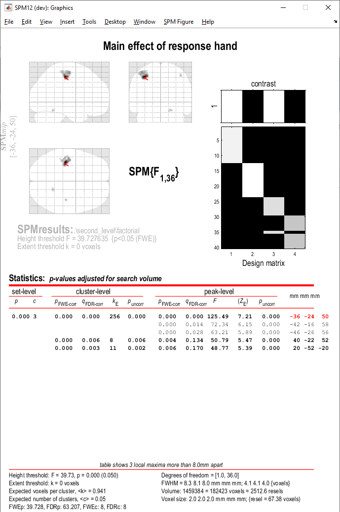

# Flexible factorial

In this tutorial we will look at investigating interactions in our data. We will do this using a flexible factorial design.

We will use the contrast corresponding to overall task activation (`con_0009.nii`) and explore whether there is an interaction between participants' handedness and the hand used to execute a task reponse. As you may remember from the [data description](./index.md), we have four groups of participants here: (1) right handed responding with their right hand, (2) right handed responding with their left hand, (3) left handed responding with their right hand, and (4) left handed responding with their left hand.  

## Specifying the model

1. Make an empty directory where you will save your results. Navigate to `derivatives/second_level` and make a folder for this analysis. Name it something meanigful to you, e.g. `factorial_handedness_response_hand_task`. 
2. Select `Specify 2nd level` from the SPM menu. 
3. In the pop-up batch editor window, select your newly created output directory by clicking `Directory` and navigating to `derivatives/second_level/factorial_handedness_response_hand_task` in the selection box.
4. Define your statistical model by selecting `Design` :material-arrow-right-bold: `Flexible factorial`.
5. Now, under `Factors` specify the factors you want to investigate, (1) `Name` :material-arrow-right-bold: `Handedness`, (2) `Name` :material-arrow-right-bold: `Response hand`. Leave the remaining options as default.
6. Now let's input our data. Under `Specify subjects or all scans & factors` you'll have two ways to do this. You can either specify your subjects and factors on at a time or select all the relevant scans for all subject in one step and manually specify a corresponding factor matrix. We will choose the latter option, `Specify subjects or all scans & factors` :material-arrow-right-bold: `Specify all`. 
7. Under `Scans` we will specify all contrast images corresponding to task activation (`con_0009.nii`) for all participants. Using the selection window recursively filter for contrast `con_0009.nii`. To do this, navigate to `derivatives/first-level` via the left-hand side panel. In the filter box, type in `^con_0009.nii` and click the `Rec` button. You should see 40 files selected in the bottom window. Double check that the correct contrast and subjects have been selected. Confirm selection by pressing `Done`. 
8. Now, we'll specify our factor matrix. SPM can explore the effects of up to four factors (including participant effects), thus the matrix is a `nscans-by-4` matrix. Our matrix is as follows:
    ```
    1	1	1
    2	1	1
    3	1	1
    4	1	1
    5	1	1
    6	1	1
    7	1	1
    8	1	1
    9	1	1
    10	1	1
    11	1	1
    12	1	1
    13	1	2
    14	1	2
    15	1	2
    16	1	2
    17	1	2
    18	1	2
    19	1	2
    20	1	2
    21	1	2
    22	1	2
    23	1	2
    24	2	1
    25	2	1
    26	2	1
    27	2	1
    28	2	1
    29	2	1
    30	2	2
    31	2	2
    32	2	2
    33	2	2
    34	2	2
    35	2	1
    36	2	2
    37	2	2
    38	2	2
    39	2	2
    40	2	2
    ```
    
    Let's break it down. 
    
    The first column indexes your participants - it should contain distinct contiguous integers if you're including a single scan per participant. If you have multiple scans per participant, make sure the rows corresponding to the same participant in the factor matrix are marked with the same index. 

    The following two columns mark the factors and their levels. In our case, we have two factors (handedness and response hand) with two levels each (left and right). That's why we have two columns filled with 1's and 2's. 
9. We will now ask SPM to model our interaction. `Main effects & interactions` :material-arrow-right-bold: `New: Interaction`. 
10. Under factor numbers, specify the factors you want to investigate in your interaction. In our case `1 2`. 
    
    !!! tip "Top tip"
        The first column of your factor matrix (i.e. participant index) is not counted as a factor by SPM, hence why for main effects and interactions we give the second and third columns indices 1 and 2, respectively. 

11. From the drop-down menu panel, select `SPM` :material-arrow-right-bold: `Stats` :material-arrow-right-bold: `Model estimation`. 
12. Navigate to `Model estimation` in the left-hand panel of the batch window. 
13. Press `Select SPM.mat` :material-arrow-right-bold: `Dependency` :material-arrow-right-bold: `Factorial design specification: SPM.mat file` :material-arrow-right-bold: `OK`. 
14. From the drop-down menu panel, select `SPM` :material-arrow-right-bold: `Stats` :material-arrow-right-bold: `Contrast manager`. 
15. Within the `Contrast manager`, click on `Select SPM.mat` :material-arrow-right-bold: `Dependency` :material-arrow-right-bold: `Model estimation: SPM.mat file` :material-arrow-right-bold: `OK`. 
16. You can now start specifying your contrasts of interest in `Contrast sessions`. 
17. Select `Contrast sessions` :material-arrow-right-bold: `New: T-contrast`.
18. Name your contrast, `Name` :material-arrow-right-bold: `Specify...` :material-arrow-right-bold: `main effect of handedness`.
19. Specify your contrast weight, `Weights vector` :material-arrow-right-bold: `Specify...` :material-arrow-right-bold: `1  1 -1 -1`. 
20. Now, do the same for the main effect of response hand - `Contrast sessions` :material-arrow-right-bold: `New: T-contrast`. `Name` :material-arrow-right-bold: `Specify...` :material-arrow-right-bold: `main effect of response hand`. `Weights vector` :material-arrow-right-bold: `Specify...` :material-arrow-right-bold: `-1 -1 1 1`.
21. And now do this for the interaction, `Contrast sessions` :material-arrow-right-bold: `New: T-contrast`. `Name` :material-arrow-right-bold: `Specify...` :material-arrow-right-bold: `interaction`. `Weights vector` :material-arrow-right-bold: `Specify...` :material-arrow-right-bold: `1 -1 -1 1`.
22. When you're ready, save your batch and press :material-play: to run your analysis.

Your design matrix will have four columns corresponding to the four possible interactions:

- Left-handed * left response hand
- Left-handed * right response hand
- Right-handed * left response hand
- Right-handed * right response hand


## Viewing the results

Let's inspect the results. Load each contrast image adjusting the thresholds as needed (for a reminder on how to do that, see the [one sample t-test tutorial](./one_sample_ttest.md)). You will notice that while we observe a main effect of response hand, there are no main effects of handedness or interaction effects that survive multiple comparisons correction. 

