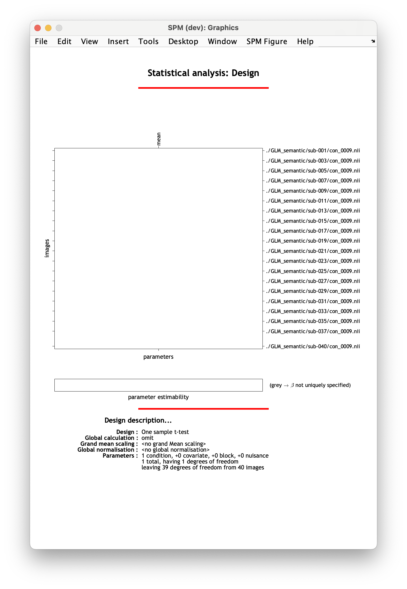
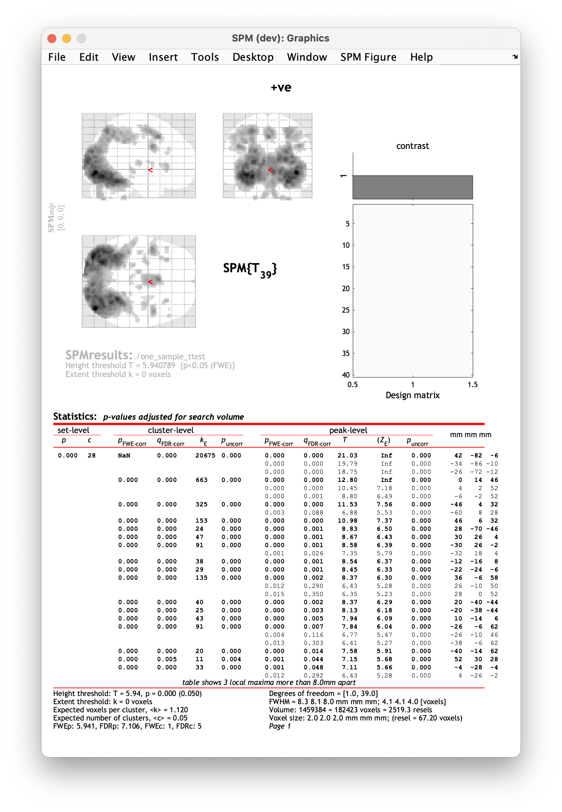
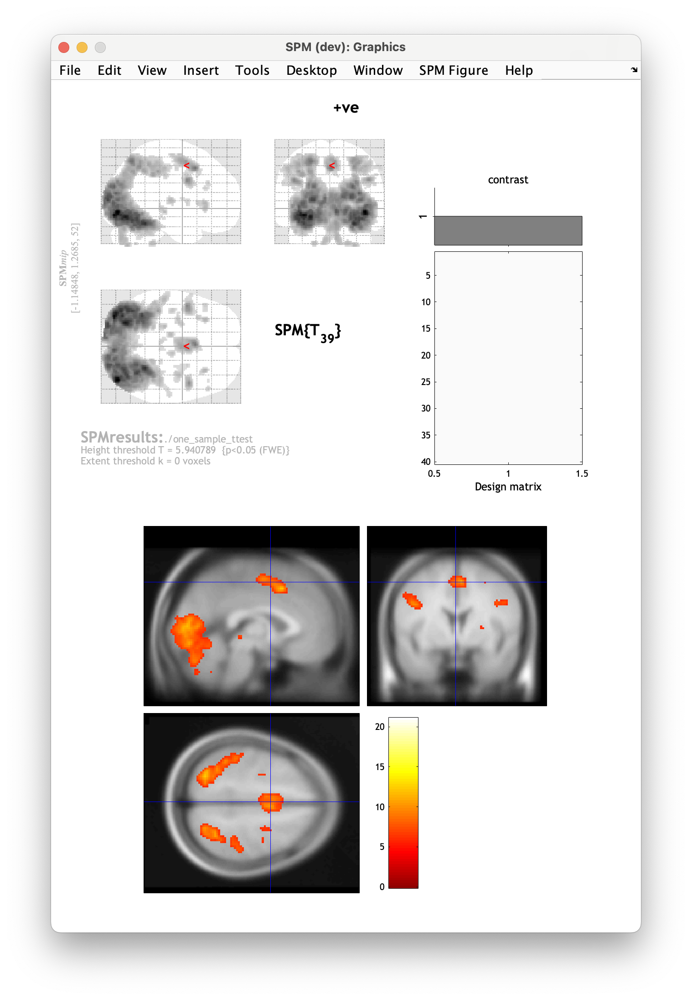

# One-sample t-test

In this this tutorial we will perform a one-sample t-test. A one-sample t-test tells us if and where in the brain our group responds to a specific task condition or experimental contrast on average. 

Here we will check if there is an overall effect of the task (i.e. contrast `con_0009.nii` - for a reminder of first-level contrasts, check [the previous page](./index.md)). 

## Specifying the model

1. Make an empty directory for where you will save your results. Navigate to `derivatives/second_level` and make a folder for this analysis. Name it something meanigful to you, e.g. `one_sample_ttest_task`. 
2. Select `Specify 2nd level` from the SPM menu. 
3. In the pop-up batch editor window, select your newly created output directory by clicking `Directory` and navigating to `derivatives/second_level/one_sample_ttest_task` in the selection box.
4. Define your statistical model by selecting `Design` :material-arrow-right-bold: `One-sample t-test`
5. Select `Scans` :material-arrow-right-bold: `Specify...`.
6. Now, using the selection window recursively filter for contrast `con_0009.nii`. To do this, navigate to `derivatives/first-level` via the left-hand side panel. In the filter box, type in `^con_0009.nii` and click the `Rec` button. You should see 40 files selected in the bottom window. Double check that the correct contrast and subjects have been selected. Confirm selection by pressing `Done`. 
7. *Optional:* You can also include covariates and/or nuisance variables in your model. These can be specified under `Covariates` and `Multiple covariates`. Your covariates should be formatted as columns with rows corresponding to each participant. Always make sure the order in which you input your partipant's contrasts in the previous step is the same as the order in your covariates list.
8. From the drop-down menu panel, select `SPM` :material-arrow-right-bold: `Stats` :material-arrow-right-bold: `Model estimation`. 
9. Navigate to `Model estimation` in the left-hand panel of the batch window. 
10. Press `Select SPM.mat` :material-arrow-right-bold: `Dependency` :material-arrow-right-bold: `Factorial design specification: SPM.mat file` :material-arrow-right-bold: `OK`. 
11. From the drop-down menu panel, select `SPM` :material-arrow-right-bold: `Stats` :material-arrow-right-bold: `Contrast manager`. 
12. Within the `Contrast manager`, click on `Select SPM.mat` :material-arrow-right-bold: `Dependency` :material-arrow-right-bold: `Model estimation: SPM.mat file` :material-arrow-right-bold: `OK`. 
13. You can now start specifying your contrasts of interest in `Contrast sessions`. We'll include two t-contrasts, one looking at activations and one looking at deactivations. Select `Contrast sessions` :material-arrow-right-bold: `New: T-contrast`.
14. Give your contrast an informative name, `Name` :material-arrow-right-bold: `Specify...`. We'll name this contrast `activations`.
15. Specify your contrast weight, `Weights vector` :material-arrow-right-bold: `Specify...` :material-arrow-right-bold: `1`. 
16. Now add another `T-contrast` calling it `deactivations` and giving it a weight of `-1`. 

    !!! info "F-contrasts"
        You can also specify an `F-contrast` with a contrast weight of `1` to look at both activations and deactivations within one contrast.  

17. *Optional:* You can also add contrasts exploring the effects of your covariates by specifying contrast weights for the corresponding columns of the design matrix. 
18. When you're ready, save your batch and press :material-play: to run your analysis.

Unless you have specified additional covariates, the design matrix for your model should have one column denoting the group effect and look like this:

## Viewing the results

To view the results of your analysis, select `Results` from the SPM menu and select the `SPM.mat` file corresponding to your analysis. In our case, this will be in `derivatives/second_level/one_sample_ttest_task`. Choose a contrast to view, e.g. `positive`. 

SPM will now let you select masking and multiple comparisons correction. Select the following in the SPM window:

- `Apply masking` :material-arrow-right-bold: `none`
- `P-value adjustment to control` :material-arrow-right-bold: `FWE`
- `P-value` :material-arrow-right-bold: `0.05`
- `Extent threshold (voxels)` :material-arrow-right-bold: `0`

??? info "A bit more about SPM results options"
    - `Apply masking` - this option allows you examine your results within a specific region, specified either from a contrast, predefined image, or atlas. To interrogate all voxels in the brain, select `none`. 
    - `P-value adjustment to control` - this lets you select whether you want to display the results as uncorrected for multiple comparisons(`none`) or with a FWE voxel/peak-level correction (`FWE`).
    - `P-value` - here you can specify your p-threshold.
    - `Extent threshold (voxels)` - this allows you set a threshold of the minimum number of contiguous voxels in a cluster to be displayed. This can be used in cluster correction. 

After going through these steps, SPM will display the results as an activation map and summary table: 

The SPM display window shows you the activation map displayed on a glass brain (top left corner) shown in a standardised space with dark blobs representing clusters over the chosen threshold. You can also view your design matrix  and the contrast you are currently viewing (top right corner). The bottom part of the results window, show summary statistics table for your results. 

The columns in the results table show:

- `cluster-level` - the chance (p) of finding a cluster with this many(`kE`) or a greater number of voxels, corrected (FWE or FDR)/uncorrected for search volume,
- `peak-level` - the chance (p) of finding (under the null hypothesis) a peak with this or a
greater height (T- or Z-statistic), corrected (FWE or FDR)/uncorrected for search volume,
- `x, y, z (mm)` - coordinates in MNI space for each maximum.

You can also display your statistical maps on a different image. To do so, from the drop down menu in the SPM results window which is anchored at `overlays`, select `sections`. In the pop-up, navigate to your the directory where SPM is saved and select `canonical/avg305T1.nii` which is standard template in MNI space. This will display your results as a heatmap on a standard brain template: 

