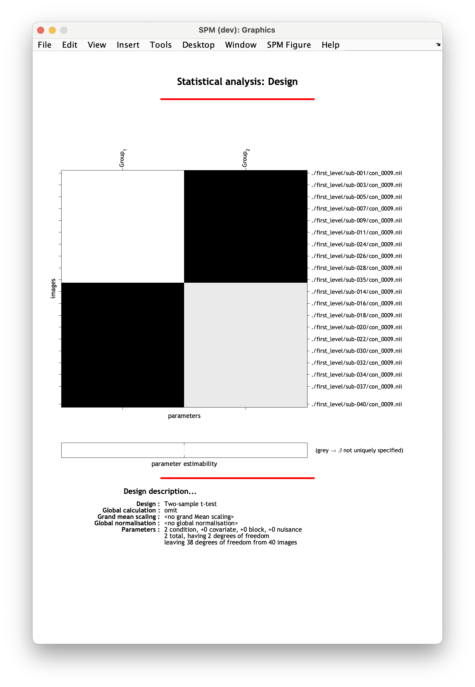
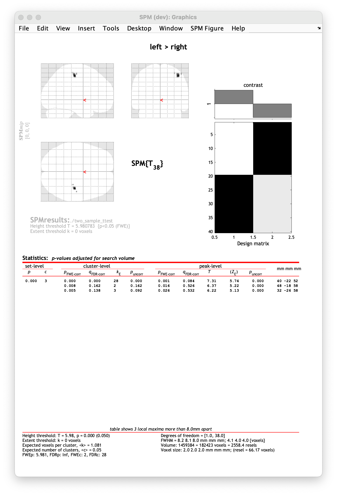

# Two-sample t-test

In this tutorial we will look at comparing two groups of participants. To do this we will use a two-sample t-test, using the dataset [previously introduced](./index.md).

We will focus on testing for a difference in overall task activation (contrast `con_0009.nii`) depending on whether participants responded with their left or right hand. 

## Specifying the model

1. Navigate to `derivatives/second_level` and make an empty directory where you will save your results. Name it something meaningful to you, e.g. `two_sample_ttest_task`. 
2. Switch to this new directory in Matlab, using the file navigator (typically on the left hand side of the Matlab window).
3. We will now define our groups based on the information in `participants.mat`. 
4. In your Matlab command window, load the file: `load('participants.mat')`.
5. You can view the contents of the file in the Matlab window. You will see that there is a variable called `response hand` which codes for which hand the participant used to make task responses. `0` corresponds to left, `1` to right.
6. We will define a variable selecting all participants who responses with their left hand. Copy and paste the following code into the Matlab command window and press enter:

    ```Matlab
    % identify which rows in the spreadsheet correspond to left-hand responders
    group1_id = find(participants.response_hand ~= true)

    % for each left-hand responder, create a full path to the contrast exploring task effects (con_0009.nii)
    for i = 1:numel(group1_id)
        sub = participants.id_string{group1_id(i)}
        img_group1{i} = char(fullfile(pwd, "derivatives/first_level", sub, "con_0009.nii"))
    end
    ```

    `img_group1` holds all the directories pointing to left-handed responder's `con_0009.nii`. 

7. Now we'll do the same for the right-hand responders:

    ```Matlab
    % identify which rows in the spreadsheet correspond to right-hand responders
    group2_id = find(participants.response_hand == true)

    % for each right-hand responder, create a full path to the contrast exploring task effects (con_0009.nii)
    for i = 1:numel(group2_id)
        sub = participants.id_string{group2_id(i)}
        img_group2{i} = char(fullfile(pwd, "derivatives/first_level", sub, "con_0009.nii"))
    end
    ```

    `img_group2` holds all directories pointing to right-hand responder's `con_0009.nii`.
    
8. Return to the main SPM menu window and select `Specify 2nd level`. 
9. In the pop-up batch editor window, select your newly created output directory by clicking `Directory` and navigating to `derivatives/second_level/two_sample_ttest_task` in the selection box.
10. Define your statistical model by selecting `Design` :material-arrow-right-bold: `Two-sample t-test`
11. Select `Group 1 scans` :material-arrow-right-bold: `Specify...`. Bring up the edit window by clicking `Ed` in the file selection window. 
12. From the edit window, you can now insert the variables you have saved in Matlab. Type in `img_group1` and press `Eval`. This should fill the window with full paths to each left-hand responder's `con_0009.nii` file. Click `Accept` :material-arrow-right-bold: `Done`.
13. Let's do the same thing for right-hand responders. `Group 2 scans` :material-arrow-right-bold: `Specify...` :material-arrow-right-bold: `Ed` :material-arrow-right-bold: `img_group2` :material-arrow-right-bold: `Eval` :material-arrow-right-bold: `Accept` :material-arrow-right-bold: `Done`.
14. From the drop-down menu, select `SPM` :material-arrow-right-bold: `Stats` :material-arrow-right-bold: `Model estimation`. 
15. Navigate to `Model estimation` in the left-hand panel of the batch window. 
16. Press `Select SPM.mat` :material-arrow-right-bold: `Dependency` :material-arrow-right-bold: `Factorial design specification: SPM.mat file` :material-arrow-right-bold: `OK`. 
17. From the drop-down menu panel, select `SPM` :material-arrow-right-bold: `Stats` :material-arrow-right-bold: `Contrast manager`. 
18. Within the `Contrast manager`, click on `Select SPM.mat` :material-arrow-right-bold: `Dependency` :material-arrow-right-bold: `Model estimation: SPM.mat file` :material-arrow-right-bold: `OK`. 
19. You can now start specifying your contrasts of interest in `Contrast sessions` comparing left to right hand responders and vice versa. 
20. Select `Contrast sessions` :material-arrow-right-bold: `New: T-contrast`.
21. Name your contrast, `Name` :material-arrow-right-bold: `Specify...` :material-arrow-right-bold: `left > right`.
22. Specify your contrast weight, `Weights vector` :material-arrow-right-bold: `Specify...` :material-arrow-right-bold: `1 -1`. 
23. Now, do the same for the reverse contrast - `Contrast sessions` :material-arrow-right-bold: `New: T-contrast`. `Name` :material-arrow-right-bold: `Specify...` :material-arrow-right-bold: `right > left`. `Weights vector` :material-arrow-right-bold: `Specify...` :material-arrow-right-bold: `-1 1`. 
24. When you're ready, save your batch and press :material-play: to run your analysis.

Your design matrix should have two columns specifying left-hand and right-hand responders:



## Viewing the results

To view the results of your analysis, select `Results` from the SPM menu and select the `SPM.mat` file corresponding to your analysis. In our case, this will be in `derivatives/second_level/two_sample_ttest_task`. Choose a contrast to view, e.g. `left > right`. 

SPM will now let you select masking and multiple comparisons correction. Select the following in the SPM window:

- `Apply masking` :material-arrow-right-bold: `none`
- `P-value adjustment to control` :material-arrow-right-bold: `FWE`
- `P-value` :material-arrow-right-bold: `0.05`
- `Extent threshold (voxels)` :material-arrow-right-bold: `0`

After going through these steps, SPM will display the results as an activation map and summary table: 



We can see that participants who used their left-hand to make responses had stronger (more positive) activation in the contralateral (right) motor cortex. 

!!! question "Exercise"
    Can you follow the steps above to view the second contrast we specified?    What do you expect the results will be? Can you display them as a heatmap on a standard template?

    If you need a reminder of what any of the options in the SPM results window are, visit the [one-sample t-test tutorial](./one_sample_ttest.md).