# Block design fMRI modelling

## Model specification and review

This tutorial uses the same auditory data described in the [fMRI preprocessing tutorial](../preprocessing/introduction.md). Before attempting this tutorial you will need a copy of the preprocessed data. Either follow the steps in the [fMRI preprocessing tutorial](../preprocessing/introduction.md) or download a copy of the preprocessed data from [here](). 

Before starting to analyse your data, set up a directory where you will save your results and give it a meaningful name, e.g. `first_level_analysis`. Then launch SPM by typing `spm fmri` in your Matlab/Octave command window and begin your analysis.

1. Press the `Specify 1st-level` button. This will call up the
specification of an fMRI specification job in the batch editor.

2. Highlight `Directory` and point SPM towards the `first_level_analysis` directory you created. 

3. Under `Timing parameters`, select `Units for design` :material-arrow-right-bold: `Scans`.

4. Highlight `Interscan interval` :material-arrow-right-bold: `7`. That's the TR in seconds.

5. Select `Data and Design` :material-arrow-right-bold: `New subject/session` :material-arrow-right-bold: `Subject/session` :material-arrow-right-bold: `Scans`.

6. In the SPM file selector pop-up, select the preprocessed functional data, i.e. `swasub-01_task-auditory_bold.nii`. These can be selected easily by typing `^swas.*` in the filter box and `NaN` underneath it. Select the data and press `Done`.

7. Highlight `Condition` and select `New: condition`.

8. Select `Condition` :material-arrow-right-bold: `Name` and enter
  `listening`. 
  
9. Highlight `Onsets` and enter `6:12:84`. 

10. Highlight `Durations` and enter `6`.

11. Save this batch for future reference - `File` :material-arrow-right-bold: `Save batch` and name it, e.g. `first_level_specification_batch.mat.`

12. Run your batch by pressing :material-play:.

SPM will now write an `SPM.mat` file to your chosen directory. It will also plot the design matrix:

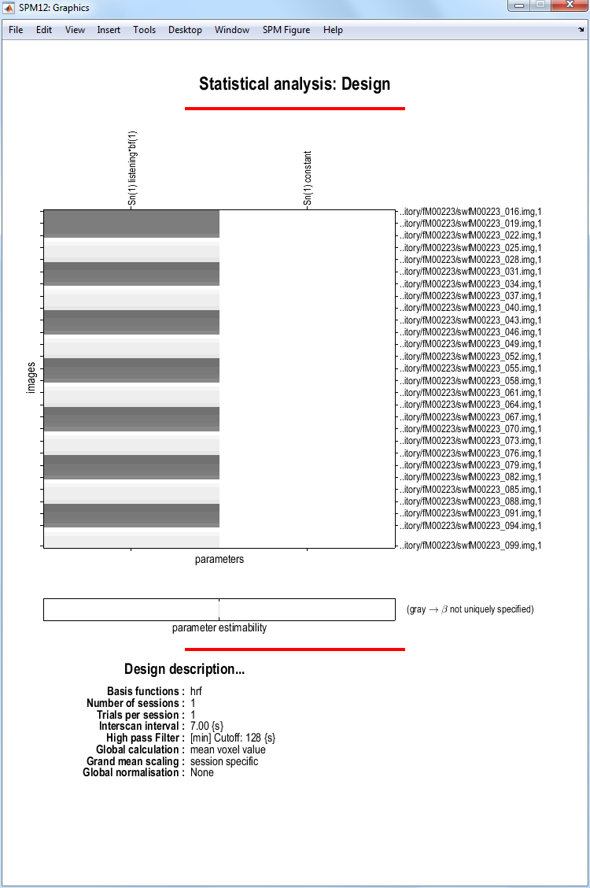

At this stage it is advisable to check your model specification using
SPM's review facility which is accessed via the `Review` button. Select the `SPM.mat` file you just created. Now click on the `Design` tab on the interactive window. If you select the first item `Design matrix`,
SPM will produce the image shown above. If you select `Explore` :material-arrow-right-bold: `Session 1` :material-arrow-right-bold: `listening`, SPM will produce the plots shown below:

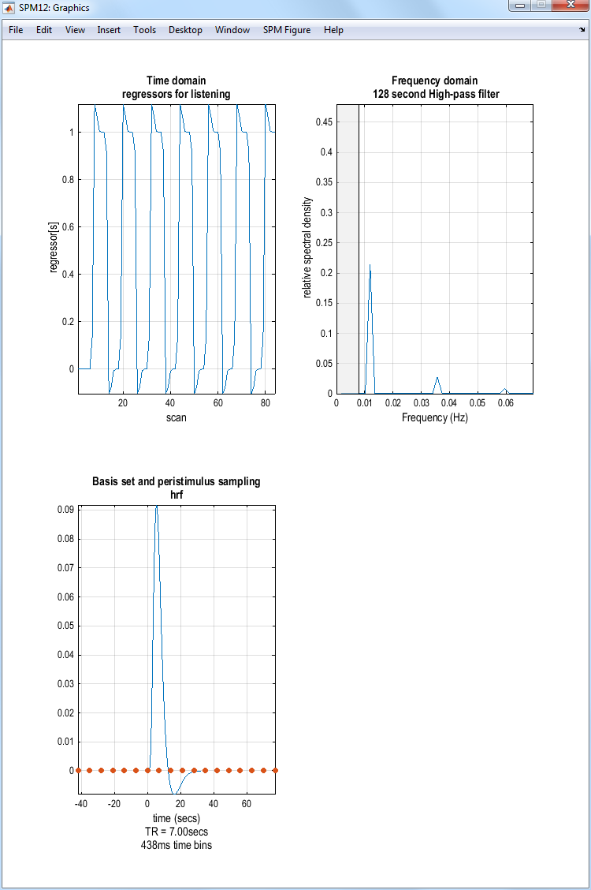

If you select the second item on the `Design` tab, `Design
orthogonality`, SPM will produce this plot: 

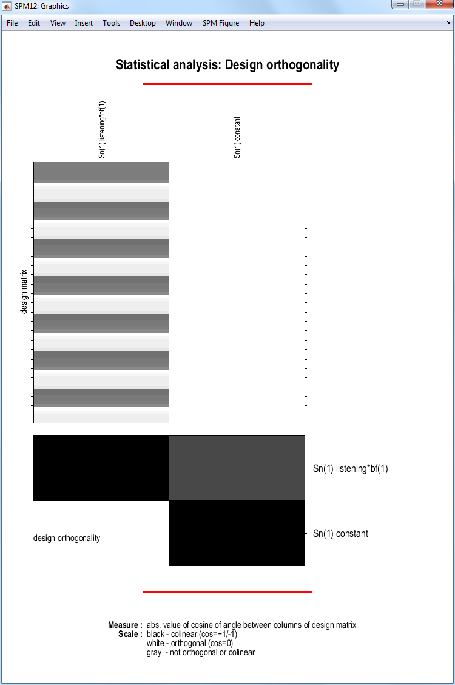

Columns $x_1$ and $x_2$ are orthogonal if the inner product $x_1^T x_2=0$. The inner product can also be written $x_1^T x_2 = |x_1||x_2| cos \theta$, where $|x|$ denotes the length of $x$ and $\theta$ is the angle between the two vectors. So, the vectors will be orthogonal if $cos \theta=0$. The upper-diagonal elements in the matrix at the bottom of the figure plot $cos\theta$ for each pair of columns in the design matrix. Here we have a single entry. A degree of non-orthogonality or collinearity is indicated by the gray shading.

## Model estimatimation

1. Press the `Estimate` button. This will call up the specification of an fMRI estimation job in the batch editor.

2. Highlight the `Select SPM.mat` option and then choose the `SPM.mat` file saved in your directory.

3. Save the job as `first_level_estimation.mat` and run your batch by pressing :material-play:.

SPM will write a number of files into the selected directory including
an `SPM.mat` file.

## Inference

1. Press `Results`.

2. Select the `SPM.mat` file created in the last section. This will bring up the contrast manager:

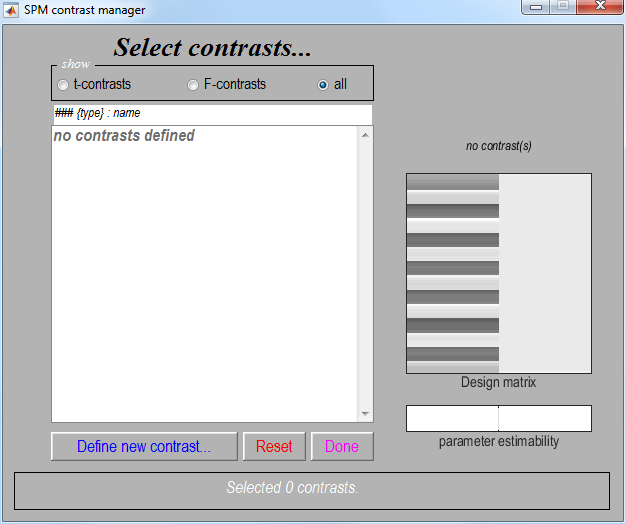

The contrast manager displays the design matrix (surfable) in the right
panel and lists specified contrasts in the left panel. Either `t-contrast` or `F-contrast` can be selected. To examine statistical results for condition effects:

1. Select `Define new contrast`

2. One-sided main effects for the listening condition (i.e. a one-sided
t-test) can be specified (in this example) as `1` (`listening > rest`)
and `-1` (`rest > listening`). SPM will accept estimable contrasts only.
Accepted contrasts are displayed at the bottom of the contrast manager
window in green, incorrect ones are displayed in red. 

3. To view a contrast, select the contrast name, e.g. `listening > rest`.

4. Press `Done`.

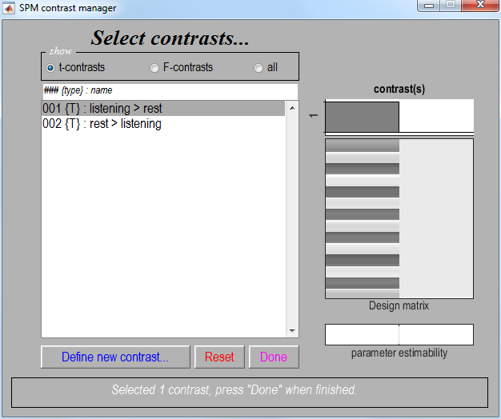

## Masking

After specifying and selecting a contrast, you will then be prompted with:

`Apply masking?` :material-arrow-right-bold: `none/contrast/image/atlas`.

Select `none`.

Masking implies selecting voxels specified by other contrasts. If `yes`, SPM will prompt for (one or more) masking contrasts, the significance level of the mask (default *p* = 0.05 uncorrected), and will ask whether an inclusive or exclusive mask should be used. Exclusive will remove all voxels which reach the default level of significance in the masking contrast, inclusive will remove all voxels which do not reach the default level of significance in the masking contrast. Masking does not affect *p*-values of the target contrast, it only includes or excludes voxels.

## Thresholds

You will then be prompted with:

`p-value adjustment to control:` :material-arrow-right-bold: `FWE/none`.

Select `FWE`.

`p-value (FWE)` :material-arrow-right-bold: accept the default value, `0.05` by pressing ++return++.

A Family Wise Error (FWE) is a false positive anywhere in the SPM. Now, imagine repeating your experiment many times and producing SPMs. The proportion of SPMs containing FWEs is the FWE rate. A value of 0.05 implies that on average 1 in 20 SPMs contains one or more false positives somewhere in the image.

If you choose the `none` option above this corresponds to making statistical inferences at the voxel level. These use uncorrected *p* values, whereas FWE thresholds are said to use corrected *p*-values. SPM's default uncorrected *p*-value is *p* = 0.001. This means that the probability of a false positive at each voxel is 0.001. So if, you have 50,000 voxels you can expect $50,000 \times 0.001 = 50$ false positives in each SPM.

You will then be prompted with:

`Extent threshold {voxels}` :material-arrow-right-bold: `0`.

Accept the default value, `0`.

Entering a value $k$ here will produce SPMs with clusters containing at least $k$ voxels. SPM will then produce the following map: 

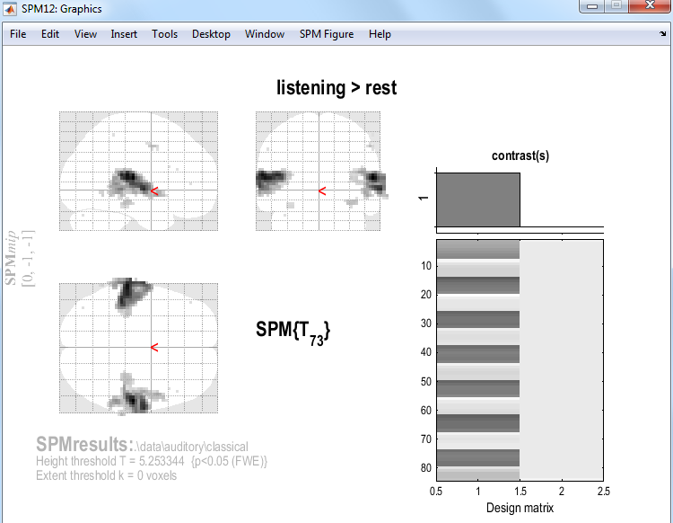

## Files

A number of files are written to the working directory at this time.
Images containing weighted parameter estimates are saved as
`con_0001.nii`, `con_0002.nii`, etc. in the working directory. Images of
T-statistics are saved as `spmT_0001.nii`, `spmT_0002.nii` etc., also in
the working directory.

## Maximum intensity projections

SPM displays a Maximum Intensity Projection (MIP) of the statistical map
in the graphics window. The MIP is projected on a glass brain in three
orthogonal planes. The MIP is surfable: right-clicking in the MIP will
activate a pulldown menu, left-clicking on the red cursor will allow it
to be dragged to a new position.

## Design matrix

SPM also displays the design matrix with the selected contrast. The design matrix is also surfable: right-clicking will show parameter names, left-clicking will show design matrix values for each scan.

In the SPM Interactive window (lower left panel) a button box appears with various options for displaying statistical results (*p*-values panel) and creating plots/overlays (visualisation panel). Clicking `Design` (upper left) will activate a pulldown menu as in the `Explore design`
option.

## Statistical tables

To get a summary of local maxima, press the `whole brain` button in the *p*-values section of the Interactive window. This will list all clusters above the chosen level of significance as well as separate (>8mm apart) maxima within a cluster, with details of significance thresholds and search volume underneath.

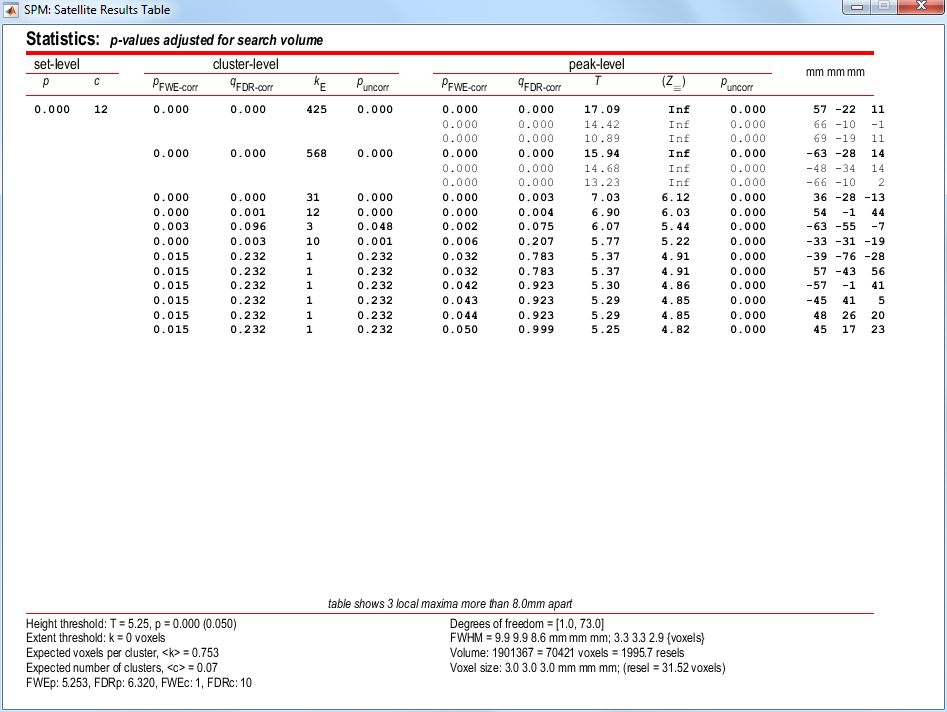

The columns in volume table show, from right to left:

- `x, y, z (mm)`: coordinates in MNI space for each maximum.

- `peak-level`: the chance (*p*) of finding (under the null
  hypothesis) a peak with this or a greater height (T- or Z-statistic),
  corrected (FWE or FDR)/uncorrected for search volume.

- `cluster-level`: the chance (*p*) of finding a cluster with this
  many (*k*) or a greater number of voxels, corrected (FWE or FDR)/
  uncorrected for search volume.

- `set-level`: the chance (*p*) of finding this (*c*) or a greater
  number of clusters in the search volume.

It is also worth noting that:

- The table is surfable: clicking a row of cluster coordinates will move
  the pointer in the MIP to that cluster, clicking other numbers will
  display the exact value in the MATLAB window (e.g. 0.000 =
  6.1971e-07).

- To inspect a specific cluster (e.g., in this example data set, the
  right auditory cortex), either move the cursor in the MIP (by
  left-clicking and dragging the cursor, or right-clicking the MIP
  background which will activate a pulldown menu).

- Alternatively, click the cluster coordinates in the volume table, or
  type the coordinates in the coordinates section of the Interactive
  window.

It is also possible to produce tables of statistical information for a single cluster of interest rather than for the whole volume. Firstly, select the relevant cluster in the MIP and then press the "current cluster" button in the *p*-values section of the Interactive window. This will show coordinates and voxel-level statistics for local maxima (>4mm apart) in the selected cluster. This table is also surfable.

## Plotting responses at a voxel

A voxel can be chosen with coordinates corresponding to those in the interactive window. The responses at this voxel can then be plotted using the `Plot` button in the visualisation section of the interactive window. This will provide you with five further options:

1. **Contrast estimates and 90% CI:** SPM will prompt for a specific contrast (e.g. `listening > rest`). The plot will show effect size and 90% confidence intervals:
    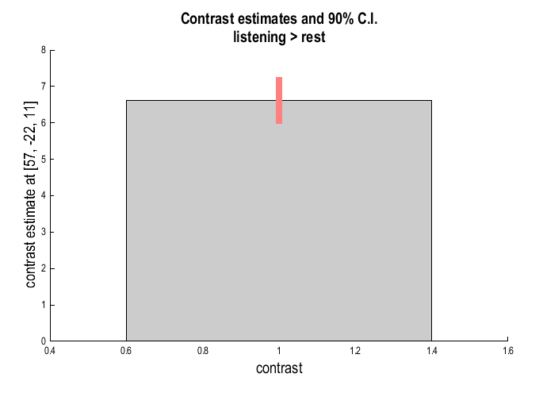

2. **Fitted responses:** Plots adjusted data and fitted response across session/subject. SPM will prompt for a specific contrast and provides the option to choose different ordinates ()`an explanatory variable`, `scan or time`, or `user specified`). If `scan or time`, the plot will show adjusted or fitted data with errors added:
    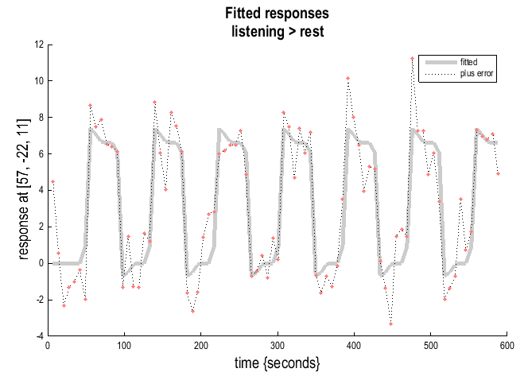

3. **Event-related responses:** Plots adjusted data and fitted response across peri-stimulus time.

4. **Parametric responses.**

5. **Volterra kernels.**

For plotting event-related responses SPM provides three options:

1. **Fitted response and PSTH (peri-stimulus time histogram):** plots mean regressor(s) (ie. averaged over session) and mean signal +/- SE for each peri-stimulus time bin.

2. **Fitted response and 90% CI:** plots mean regressor(s) along with a 90% confidence interval.

3. **Fitted response and adjusted data:** plots regressor(s) and individual data (note that in this example the data are shown in columns due to the fixed TR/ISI relationship).

It is worth noting that:

- The values for the fitted response across session/subject for the selected plot can be displayed and accessed in the window by typing `y`. Typing `y` will display the adjusted data.

- `Adjusted` data = adjusted for confounds (e.g. global flow) and high- and low-pass filtering.

## Overlays

The visualisation section of the interactive window also provides an overlay facility for anatomical visualisation of clusters of activation. Pressing `Overlays` will activate a pulldown menu with several options including:

1. **Slices:** overlay on three adjacent (2mm) transaxial slices. SPM will prompt for an image for rendering. This could be a canonical image (see `spm_templates.man`) or an individual T1/mean EPI image for single-subject analyses. Beware that the left-right convention in the display of that option will depend on how your data are actually stored on disk.

2. **Sections:** overlay on three intersecting (sagittal, coronal, axial) slices. These renderings are surfable: clicking the images will move the crosshair.

3. **Render:** overlay on a volume rendered brain.

Thresholded SPMs can be saved as NIfTI image files in the working directory by using the "Save" button in the Interactive window. In the figures below the `listening > rest` activation has been superimposed on a spatially normalised, bias-corrected anatomical image.

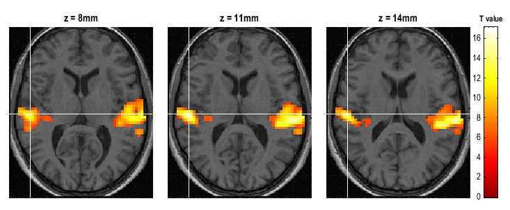

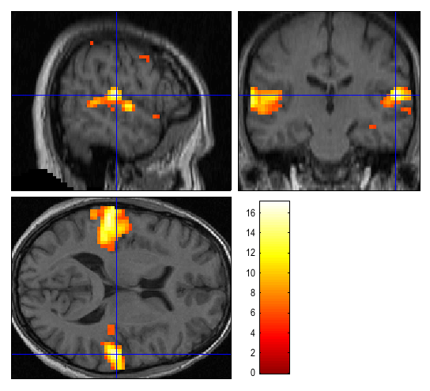 

For the `Render` option, we first created a rendering for this subject.

This was implemented by:

1. `Normalise (Write)` the two images `c1sub-01_T1w.nii` and
  `c2sub-01_T1w.nii` using the `Deformation Field` `y_sub-01_T1w.nii`
  and a voxel size of `[1 1 1]`.

2. Selecting `Extract Surface` from the `Render` pulldown menu.

3. Selecting the gray and white matter images `wc1sub-01_T1w.nii` and
  `wc2sub-01_T1w.nii` created in the first step.

4. Saving the results using the default options (`Rendering and surface`).

SPM plots the rendered anatomical image in the graphics window and saves it as `render_wc1sub-01_T1w.mat`. The surface image is saved as `surf_wc1sub-01_T1w.mat`.

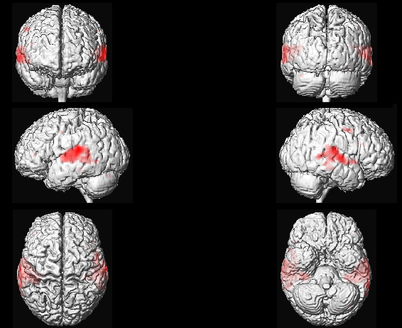

It is also possible to project and display the results on a surface mesh, we are going to use here one of the canonical mesh distributed with SPM (in MNI space). Press `Overlays` and choose `Render`, then go in the `canonical` folder of your SPM installation and select file `cortex_20484.surf.gii` (this is a surface mesh stored using the GIfTI format) and you will obtain a figure similar to the one above.

Ashburner, J., and K. J. Friston. 2005. "Unified Segmentation."
*NeuroImage* 26: 839--51.
<https://doi.org/doi:10.1016/j.neuroimage.2005.02.018>.

[^1]: Auditory fMRI dataset:
    <http://www.fil.ion.ucl.ac.uk/spm/data/auditory/>

[^2]: Beginners may wish to skip this step, and instead just superimpose
    functional activations on an "average structural image".