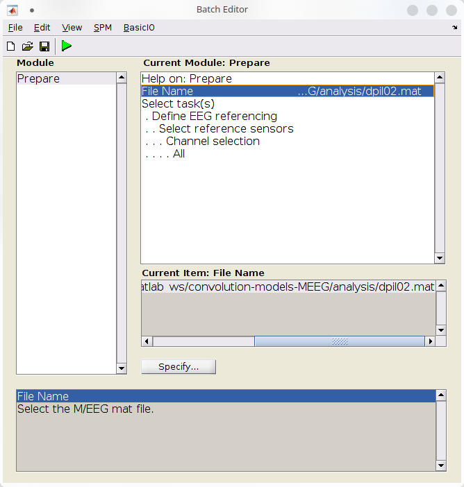
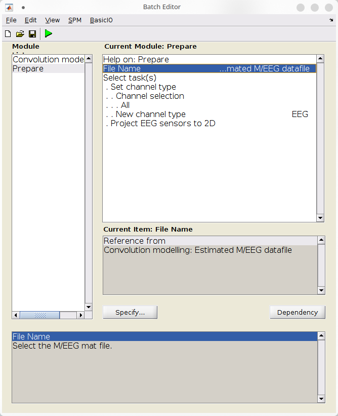
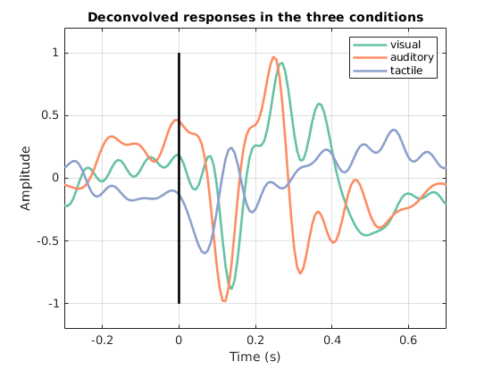

# Convolution modelling of M/EEG data

This chapter demonstrates an example of first-level modelling of M/EEG data using the convolution GLM introduced in *(V. Litvak et al., 2013)*[@Litvak_ConvModel_2013]. The example is based on a workshop held by B. Spitzer in 2015 ([see on GitHub](https://github.com/bernspitz/convolution-models-MEEG)) and reproduces the results presented in *(B. Spitzer et al., 2016)*[@spitzer2016rhythmic] for a single subject.

## Overview

The experimental setup involved presenting visual, auditory, and somatosensory stimuli to subjects in a supramodal integration task. In this example, we aim to investigate the EEG response to different modalities of sensory stimuli, specifically visual, auditory, and tactile pulses. To compare the responses, we want to capture the average event-related response for each modality across trials. However, conventional methods of averaging across trials to generate an event-related potential are not suitable for this experiment because the delay between consecutive pulses can be as short as 100 ms, resulting in overlap of the responses over time. Therefore, we need to employ more elaborate techniques to disentangle -- more precisely, to deconvolve -- the responses over time.

The convolution GLM provides a way to deconvolve the responses using a standard GLM with some particular regressors in its design matrix. In convolution GLM, the rows of the design matrix represent time, and the response regressors are obtained by convolving event indicators with a basis set. This allows us to model the possible overlap between responses to consecutive stimulis. Here, we will see how to parameterize the basis set and its duration, as well as the events, to perform convolution modelling in SPM.

??? note "Experimental design"
    In the following, we will be analysing single subject data. Visual stimuli were white light-emitting diodes, auditory stimuli were 1 kHz sine tones, and somatosensory stimuli were square-wave electric median nerve stimulation. Subjects were presented with a standard sequence (N1) followed by a delay and then a comparison sequence (N2) which contained the same number of pulses as N1 ± 1 pulse. Subjects were instructed to respond by pressing a foot pedal after the N2 interval offset, to identify which of the two sequences contained the more pulses. EEG was recorded from 64 active electrodes and ocular activity was registered via two pairs of additional electrodes.

## Convolution GLM for M/EEG data

### Preparing the data

The data provided ([here](https://www.fil.ion.ucl.ac.uk/spm/data/eeg_supramodal/)) for this tutorial have already been preprocessed. However, there are still a few preparation steps required: we need to re-reference, filter, and mark artefacts. To do so:

#### 1. Rereferencing

-   Start SPM in EEG mode.
-   Click on "Prepare (batch)" in the upper panel of the main SPM window,
-   Configure the "Prepare" batch:
    +   Under file name, select "dpil02.mat",
    +   Under "Select task(s)", select "EEG referencing" and leave defaults settings to reference against the average.

<figure markdown>
  {#fig:meeg-firstlevel:prepare width:"75%"}
  <figcaption>Options for the Prepare batch</figcaption>
</figure>
    

#### 2. Filtering

-   Add a "filter" batch (SPM &gt;M/EEG &gt;Preprocessing &gt;Filter),
-   Configure a 5th-order Butterworth highpass filter at $0.5Hz$:
    +   Under file name, use the dependency button to refer to the file produced by the previous batch,
    +   Under "Band", select "Highpass",
    +   Under "Cutoff(s)", specify "0.5",

<figure markdown>
  {#fig:meeg-firstlevel:filter width:"75%"}
  <figcaption>Options for the Filter batch</figcaption>
</figure>

#### 3. Marking artefacts

-   Add an "Artefact detection" batch (SPM &gt;M/EEG &gt;Preprocessing &gt;Artefact detection),
-   Configure the batch to mark artefactual samples:
    +   Under file name, use the dependency button to refer to the file produced by the previous batch,
    +   Under "Mode", select "Mark",
    +   Under "Detection algorithm", select "Threshold channels",
    +   Under "Threshold", specify "0.8",
    +   Under "Excision window", specify "300",

<figure markdown>
  {#fig:meeg-firstlevel:artefacts-options width:"75%"}
  <figcaption>Options for the Artefacts batch</figcaption>
</figure>

#### 4. Running the batch

Now that we have configured all the preprocessing steps, we can run the batch with the "Play" button.This batch should populate several files, the last being "afMdpil02.mat", containing the data that we will model with convolution GLM.

### Constructing the convolution GLM model

#### 1. Preliminary steps

We shall first load the file called "events.mat". It contains the events onset times are stored in 3 cells corresponding to visual, auditory, and tactile events. 

We can then configure our convolution model. Start it by clicking on "Specify 1st-level" on the main SPM window. 

#### 2. Channels and timing

The first step is to tell SPM that we want to model the response on our EEG channels, in a peristimulus time window between 300ms before and 700ms after event onset.

-   Specify the channels to model under "Channel selection":
    +   Remove the default entry ("Delete: All")
    +   Click "Select channel by type" &gt; "EEG"
-   Specify the timing parameters
    +   Under "Time window", set $[-300 \;\; 700]$. 
    +   Under "Unit for design", set "seconds"

<figure markdown>
  {#fig:meeg-firstlevel:conv-top width:"75%"}
  <figcaption>Setting the channels and timing parameters of the convolution model</figcaption>
</figure>

#### 2. Model structure

We can now specify the structure of the model, in particular, the timing of the events that we want to model.  

-   Under "M/EEG dataset", select the last file produced at the previous section ("afMdpil02.mat"),
-   We will now specify the events for each condition. To do so:
    +   Click "Conditions" &gt; "New: Condition",
    +   Under name, set "visual",
    +   We will set the event times manually. Under "How to define events", select "Manually"
    +   Under "Onset", type "events{1}". This corresponds to the event onsets times from the "events.mat" file for event 1
    +   Under "Duration", set 0. This will cause SPM to create stick functions at event onset.
    +   Leave over parameters of that section to their defauls
-   Repeat the previous steps for "auditory" and "tactile" events, whose onsets are stored in "events{2}" and "events{3}".

<figure markdown>
  {#fig:meeg-firstlevel:conv-other width:"75%"}
  <figcaption>Specifying the conditions of the convolution model</figcaption>
</figure>

#### 3. Basis set

The last important step is to specify the basis set and its order. Under "Basis Functions":
+   Make sure that the selected basis set is "Fourier Set".
+   Make sure that the "Order" is 12.

<figure markdown>
  {#fig:meeg-firstlevel:conv-basis width:"75%"}
  <figcaption>Specifying the conditions of the convolution model</figcaption>
</figure>

#### 4. Extra step (for visualization purposes only)

A final step is to restablish the sensors type and locations using a Prepare batch (SPM &gt; M/EEG &gt; Preprocessing &gt; Prepare).

-   Under "File name", click "Dependency" and select the output from the Convolution modelling batch,
-   Under "Select task(s)":
    +   Click "Set channel type", and set "New channel type" to "EEG"
    +   Click "Project EEG sensors to 2D".

<figure markdown>
  {#fig:meeg-firstlevel:prepare-post-conv width:"75%"}
  <figcaption>Final prepare batch to fix sensors types and locations.</figcaption>
</figure>
    
Finally, run the batch.

### Summary

To summarize, we have generated a Convolution GLM batch for our model to capture the response to each condition within a specific timeframe. Specifically, the design matrix created for this purpose has captured responses between 300ms before and 700ms after event onset, by expanding it on a 12th-order Fourier basis. This enables us to express the response as the weighted sum of 12 cosines and 12 sines, along with an intercept that captures the mean value. Note that the window of 1 second and the 12th-order Fourier basis allows us to capture oscillations between 1 and 12Hz, with a frequency resolution of 1Hz.

Using SPM, the convolution GLM generates a new M/EEG dataset that contains the deconvolved responses as evoked data. 

!!! tip "Under the hood, SPM performs several operations..."
    1.   It creates a design matrix $X$ for our problem $Y = X \beta + \varepsilon$, with time as rows and basis functions for each condition as columns.
    2.   It then inverts the model to obtain an estimate of the parameters that weight the basis set, represented by $\beta = (X^TX)^{-1} X^T Y$. The rows of $\beta$ correspond to the weight of each basis function, stacked for each condition $c$.
    3.   It uses the basis function weights for condition $c$ to construct the deconvolved responses, represented by $y_c = x_{BF} \beta_c$.

Thus, the batch in this tutorial results in a M/EEG dataset of evoked responses, which contains three trials for each of our three conditions.

## Results

The results can be visualized in the SPM's M/EEG viewer, which is in the "Display..." menu in the main SPM window. Selecting EEG and then clicking on the scalp image shows the deconvolved response over the scalp. By positioning the peristimulus time cursor tenth to hundreds of milliseconds after stimulus onset, we can observe the stereo-typical scalp maps of visual, auditory, and tactile stimuli (Figure [1.8](#fig:meeg-firstlevel:scalp){reference-type="ref" reference="fig:meeg-firstlevel:scalp"}). In summary, convolution modelling proves to be a powerful tool to disentangle responses that overlap over time (Figure [1.9](#fig:meeg-firstlevel:responses){reference-type="ref" reference="fig:meeg-firstlevel:responses"}), and can be used as a preliminary step to extract event related responses for subsequent statistical analysis.

<figure markdown>
  [Scalp maps of deconvolved responses to the different stimuli at particular time of interest](../../assets/figures/tutorials/meeg/meeg_firstlevel/scalp.png){#fig:meeg-firstlevel:scalp width:"75%"}
  <figcaption>Scalp maps of deconvolved responses to the different stimuli at particular time of interest.</figcaption>
</figure>

<figure markdown>
  {#fig:meeg-firstlevel:responses width:"75%"}
  <figcaption>Average responses over fronto-central channels for the different stimuli.</figcaption>
</figure>

## Acknowledgments

We thank Bernhard Spitzer for putting up the code from which this tutorial derives and for kindly allowing us to share the data analysed in this chapter.