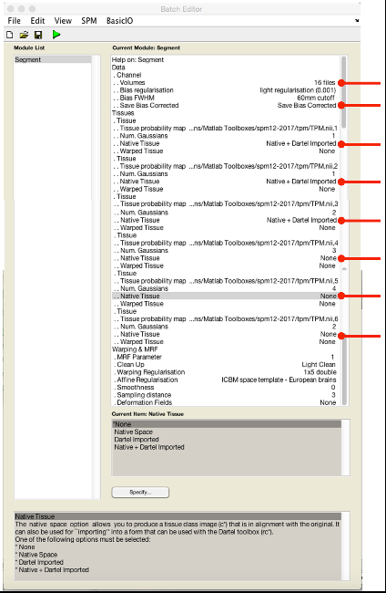
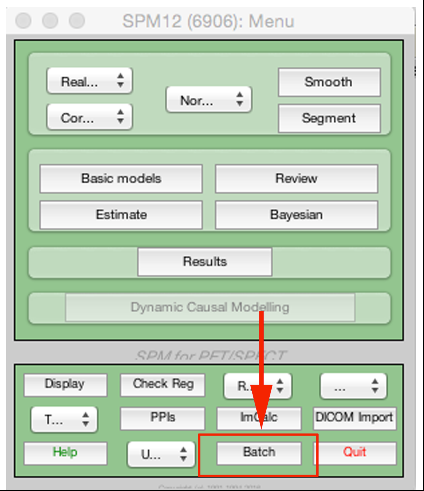
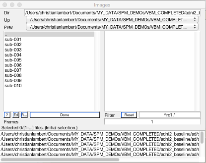
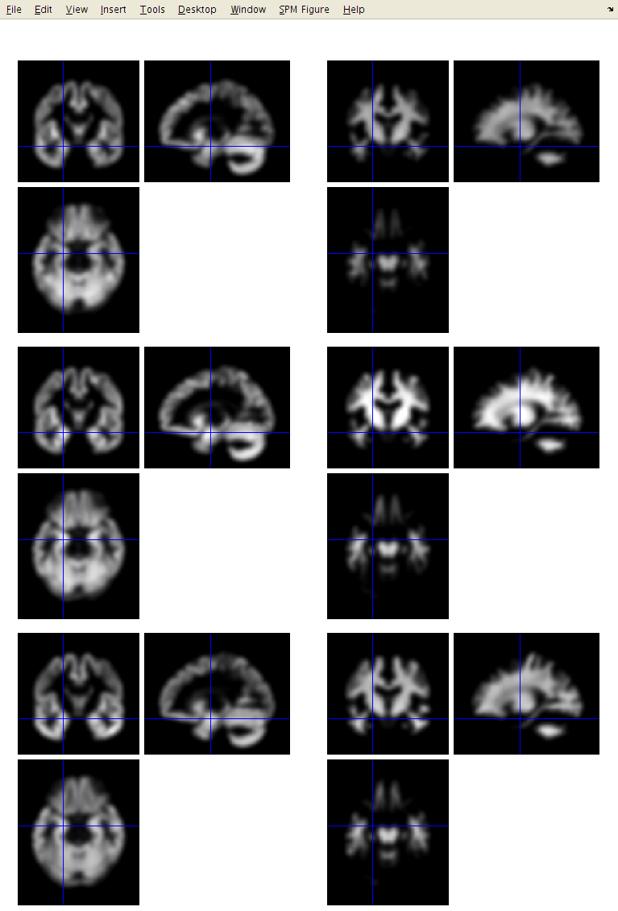

# Structural preprocessing

Here is an overview of the structural pre-processing steps we are aiming to achieve:

#

!!! tip "Important before starting"
    While the SPM pipelines do an excellent job of combining and realigning data, they do rely on the source data (i.e. all of the T1w MRIs in native subject space) being in reasonably close alignment to one another.
     
    Before starting any analysis, you should always visually check your data. This is by far and away the most common source of errors/mistakes, and it is much easier to correct at the start.
     
    To do this, use the `Check registration` function in the SPM main menu. You can select up to 24 images at a time:
    
    

    In the example above, we can see that the bottom right MRI is very poorly aligned with the rest. This is unlikely to be successfully processed and may cause problems later. It is easier to manually realign images like these at the start. 

    To do this, right click on the MRI with the issue, and select `Re-orientate image` and `Current image` from the menu:
    
        
    
    This will open a window with 9 affine transforms you can manually specify until you have reasonably good alignment. Then just `Apply to images`. It is a good idea to store the transformation matrix for reference.

    

## Segmentation

Assuming your data has been successfully imported, you have checked it for any problems and corrected any issues, the next step is to segment the brain into different tissue types. SPM12 will produce up to six tissues:

- c1 – Grey Matter
- c2 – White Matter
- c3 - CSF
- c4 - Bone
- c5 – Soft tissue
- c6 – Everything else

For VBM, we are interested in analyzing the grey and white matter. In these processing steps, we will also include the CSF for generating the group template, brain mask, and calculating total intracranial volume.

First select `Segment` from the SPM menu:


This will open up the segmentation batch menu. There are a lot of options available that we will not explore here.

First double click on volumes. This will open a file select box, where we will select all of the T1w images we want to analyse:


Rather than selecting each file manually, you can speed this up using recursive search (shown above). At the end of the filter add `.nii` (to specify you want to look for all of the nifti files within the directories above) and then hit `Rec` (arrow). We will use this again later with other file specifiers. 

You will now need to modify the following options (summarized in the next figure):  
- `Save INU corrected` :material-arrow-right-bold: `Save INU corrected` (for making group average brain to project results on later).  
- `Native tissue` :material-arrow-right-bold: `Native and imported` for tissue classes 1-3  
- `Native tissue` :material-arrow-right-bold: `None` for tissue classes 4-6



Before processing the data, it is a good idea to save the batch in case you need to re-do/check again later: 


This may take a little while to complete, depending on the size of your dataset and computer. The output in each file directory will be:
- `c1[filename].nii` – Native space grey matter segmentation  
- `c2[filename].nii` – Native space white matter segmentation  
- `c3[filename].nii` – Native space CSF segmentation  
- `rc1[filename].nii` – Dartel import space grey matter segmentation  
- `rc2[filename].nii` – Dartel import space white matter segmentation  
- `rc3[filename].nii` – Dartel import space CSF segmentation  
- `m[filename].nii` – Native space bias corrected T1w  
- `[filename]_seg8.mat` – Various normalization transform data

Below is a figure showing native `c1` (left) and `dartel import` (right) segmentations. Basically, `dartel import` is orientated (rigidly aligned) with MNI space, meaning every subject’s data is in reasonably close alignment with one another which will help produce better results using the warping algorithms. 


!!! tip "Visual inspection"
    It is a good idea to visually check your segmentation results for errors/problems at this stage before moving onto Shoot.

## Shoot

Geodesic shooting is a diffeomorphic warping algorithm designed to non-linearly align the brain data. It has recently been developed building on the earlier Dartel pipeline. As such, it does not yet have as many additional functions compared to Dartel, so requires some additional manual steps to use (covered here). However, the overall impression is that it is better than Dartel and will be increasingly used in the future, therefore it is the pipeline used here. 

To use, first open the SPM batch window:



From there, you want to select `SPM` :material-arrow-right-bold: `Tools` :material-arrow-right-bold: `Shoot tools` :material-arrow-right-bold: `Run shooting (create templates)`:


This will open up the Shoot batch window:


Click on `New: Images` for each tissue class you are going to use for generating the population average template. Here I am going to use GM, WM and CSF so I create three `Images` channels.

Now double click on each image channel to add the data. Here you will need to select your `Dartel import` tissue classes. Again I’m going to use recursive search by typing `^rc1.*` and pressing `Rec`. This will find all the GM. Then click `Done`.

Repeat this process for the remaining two channels, using `^rc2.*` for WM and `^rc3.*` for CSF.



When you inputted the data correctly, the arrow should go green. Again it is sensible to save your batch at this stage.


!!! info "Time considerations"
    This is the slowest part of the entire pipeline, and may take hours-days depending on data size/computer.  

The output in each file directory will be:  
- `y_rc1[filename].nii` – Deformation field  
- `j_rc1[filename].nii` – Jacobian determinants  
- `v_rc1[filename].nii` – Velocity field

Additionally, in the first directory you will find five template images (0-4). These are 4D files (containing GM, WM, CSF, other) showing various stages in estimating the population average:


Importantly, this process estimates a population average template. This is a type of group average space that is unique to your study population. This is **not** MNI space (MNI is a type of population average space), however it will be very close. 

!!! info "Template spaces"
    You can conduct and publish your entire analysis in your specific population average space.
    
    If you want your results in MNI space (e.g. for data-sharing results maps/coordinates), you can do this using the `Co-registration` function (MNI = reference, population average = source, other = any results/data you want to move to MNI).


## **Write Normalised**

This step uses the resulting `y_rc1` files (deformation fields), to generate smoothed, spatially normalised and Jacobian scaled grey matter images in MNI space.
From here we need to select `SPM` :material-arrow-right-bold: `Tools` :material-arrow-right-bold: `Shoot tools` :material-arrow-right-bold: `Write normalised`

* **Shoot Template**: Select the final template image created in the previous step.  This is usually called Template\_4.nii and can be found in the first subject's directory.  This template is registered to MNI space (affine transform), allowing the transformations to be combined so that all the individual spatially normalised scans can also be brought into MNI space.

* **Select according to**: Choose **Many Subjects**, as this allows all deformation fields to be selected at once, and then all grey matter images to be selected at once.

    * **Many Subjects**

        * **Deformation fields**: Select all the deformation fields created by the previous step (``y_*.nii``).

        * **Images**: Need one channel of images if only analysing grey matter.

            * **Images**: Select all the grey matter images (``c1*.nii``), in the same order as the deformation fields.

* **Voxel Sizes**: Specify voxel sizes for spatially normalised images.  Leave as is ```NaN NaN NaN```, to have 1.5 mm voxels.

* **Bounding box**: The field of view to be included in the spatially normalised images can be specified here.  For now though, just leave at the default settings.

* **Preserve**: For VBM, this should be set to **Preserve Amount ("modulation")**, so that tissue volumes are compared.

* **Gaussian FWHM**: Specify the size of the Gaussian (in mm) for smoothing the processed data by.  This is typically between about 4mm and 12mm.  Use 6mm for now.

??? info "How much to smooth?"
    The optimal value for FWHM depends on many things, but one of the main ones is the accuracy with which the images can be registered.
    If spatial normalisation (inter-subject alignment to some reference space) is done using a simple model with fewer than a few thousand parameters, then more smoothing (e.g. about 12 mm FWHM) would be suggested.
    For more accurately aligned images, the amount of smoothing can be decreased.
    About 8mm may be suitable, but there is not much empirical evidence to suggest appropriate values.
    The optimal value is likely to vary from region to region: lower for subcortical regions with less variability, and more for the highly variable cortex.

<figure id="Fig:Processed" markdown>
{width=50%}
<figcaption> Processed grey and white matter data for three subjects, which are smoothed by 8 mm FWHM. Note that all data are shown scaled the same, which illustrates the effect of different global brain sizes (darker for smaller brains because structures are smaller).  </figcaption>
</figure>

The smoothed images represent the regional volume of tissue.
Statistical analysis is done using these data, so one would hope that differences among the processed data actually reflect differences among the regional volumes of grey matter.

<figure id="Fig:interpretation" markdown>
{width=90%}
<figcaption> We generally hope that the results of VBM analyses can be interpreted as systematic volumetric differences (such as folding or thickness), rather than artifacts (such as misclassification or misregistration).  Because of this, it is essential that the processing be as accurate as possible. Note that exactly the same argument can be made of the results of manual volumetry, which depend on the accuracy with which the regions are defined, and on whether there is any systematic error made.  </figcaption>
</figure>

 
